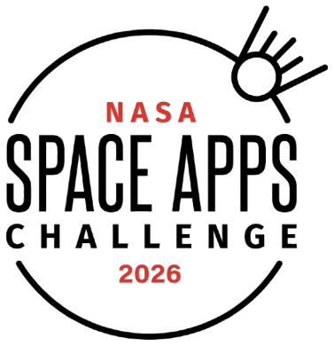
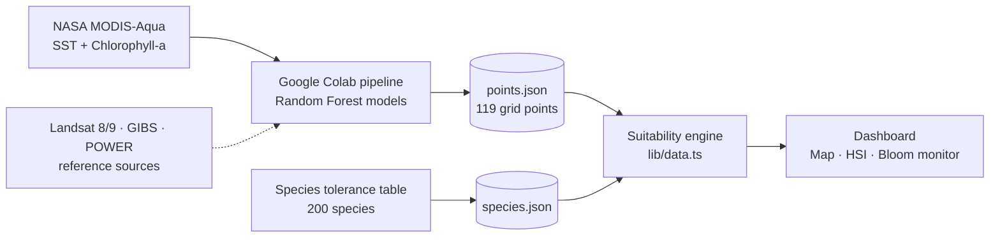

<div align="center">

&nbsp;&nbsp;&nbsp;

# NobhoAqua

### NASA Earth-observation intelligence for coastal fisheries, aquaculture and space bio-research

*Know where the fish are — before you leave the shore.*


**Built by Team NobhoJol** · Challenge: *Field Shift — Adapting Farms with NASA Data*

</div>

---

## Why NobhoAqua?

Small-scale fishers burn expensive diesel searching for fish, and aquaculture farmers can lose a whole pond to a harmful algal bloom they never saw coming. NASA satellites already measure the ocean's temperature and chlorophyll every day — but that data is raw, technical and hard to act on.

**NobhoAqua turns satellite observations into decisions:** where to fish, which species to expect there, and when the water is turning dangerous.

## 🌊 Why NobhoAqua?

Small-scale fishers burn expensive diesel searching for fish, and aquaculture farmers can lose a whole pond to a **harmful algal bloom (HAB)** they never saw coming. NASA satellites already measure the ocean's temperature and chlorophyll every day, but that data is raw, technical and hard to act on.

**NobhoAqua turns satellite observations into decisions**, answering three questions:

| Question | Answer from NobhoAqua |
| --- | --- |
| 🎣 **Where to fish?** | Potential Fishing Zones (PFZ) on an interactive Bay of Bengal map |
| 🐟 **Which species to expect there?** | Habitat suitability ranking across 200 saltwater species |
| ⚠️ **When does the water turn dangerous?** | 24–48 h algal-bloom alerts with farm-management advice |

### Who is it for?

| User | Need |
| --- | --- |
| Small-scale fishers | Fishing-zone guidance to cut fuel use (mobile-first, slow networks) |
| Aquaculture farmers | Early warning of algal blooms |
| Researchers and students | Species and model insights for fisheries, ecology and space bio-research |
| Policy and NGO analysts | Aggregate maps and alerts that support SDG 14 programmes |

---

## Features

The core of the product is a login-protected **dashboard** with three modules:

| Module | What it does |
|---|---|
| 🗺️ **Ocean Heatmap & Fishing Zone Map** | Interactive Bay of Bengal map with switchable layers — *Fishing zones (PFZ)*, *Sea temperature*, *Chlorophyll-a* and *Algal alerts*. Click any of the 119 grid points for coordinates, ocean metrics and the most likely species. Mouse-wheel zoom, themed tiles. |
| 🐟 **Species Habitat Suitability Predictor** | Search **200 saltwater species** (common or scientific name, group filter, keyboard navigation). Each profile includes an interactive **3D fish** (drag to rotate; shape and colour adapt to the species) and shows oxygen / temperature / pH / chlorophyll-a tolerance gauges, the best places to find it (with CSV export of coordinates) and similar-habitat species. A reverse **“Where can I get which fish?”** finder ranks fish for any chosen area or point. |
| 🦐 **Aquaculture & Algal Bloom Monitor** | Counts of critical / moderate / normal bloom alerts, a temperature-vs-chlorophyll scatter, per-area risk bars and farm advice, plus model insights (HSI distributions and a parameter correlation matrix). |

Around the dashboard the site also includes:

- **Landing page** with an animated underwater hero (layered waves, sunlight rays, swimming fish), Mission, Vision, About, *The Challenge* and *Target Audience*.
- **Storybook user manual** (`/guide`) — a chapter-by-chapter story that teaches every feature.
- **Datasets & Resources** (`/resources`) — every NASA/USGS source plus our Google Colab notebook.
- **Team section**, **demo login / sign-up**, light & dark themes, and a fully responsive, accessible UI (keyboard navigation, ARIA roles, reduced-motion support).

## How it works



1. **Observe** — satellite-derived temperature, chlorophyll-a, salinity and depth for 119 Bay of Bengal grid points (Sundarbans Estuary, Meghna River Mouth, Kuakata Offshore).
2. **Model** — in Google Colab, a Random-Forest regressor predicts habitat suitability (HSI) for Hilsa, Tuna and Shrimp (**MSE 0.0031**) and a Random-Forest classifier predicts 24–48 h algal-bloom alerts (**79.17 % accuracy**).
3. **Match** — for every other species, suitability at each point is computed by comparing the observed temperature and chlorophyll-a with that species' tolerance range (full score near the centre of the range, 80 % at its edge, tapering to zero outside). Hilsa and Tuna use the ML model's scores directly.
4. **Decide** — rankings, maps and alerts in the dashboard.

> **Honest limits.** Range-matched scores are *estimates*: they do not check a species' native geographic range, and dissolved-oxygen and pH are shown but not scored (no per-point values exist). Treat results as decision support, not a guarantee of a catch.

## Tech stack

- **Framework:** Next.js 16 (App Router, Turbopack), React 19, TypeScript
- **Styling:** Tailwind CSS 4 with a theme-token system (dark / light)
- **Maps:** Leaflet + react-leaflet (dynamic, client-only)
- **3D:** three.js (procedural, species-aware fish models)
- **Motion:** Framer Motion · **Icons:** lucide-react
- **Charts:** hand-built SVG (scatter, gauges, box plots, heatmap) — no chart library
- **Data prep:** Python scripts + Google Colab (scikit-learn, pandas, Plotly)

## Getting started

**Requirements:** Node.js 20+ and npm.

```bash
# install
npm install

# run the dev server → http://localhost:3000
npm run dev

# production build
npm run build && npm start

# lint
npm run lint
```

## 🧪 Try it

1. Open the **[live site](https://nobho-aqua.vercel.app/)** and choose **Sign up** (or **Continue with demo account**).
2. Demo credentials: `demo@nobhojol.app` / `demo1234`.
3. Explore the three dashboard tabs, then read the **User Manual** at `/guide`.

> ⚠️ **Authentication is a demo.** In the current public release, accounts are stored in your browser's `localStorage` only. There is no server and no real security. Don't use a real password.

---

## Project structure

```text
app/
  page.tsx            Landing page
  dashboard/          Protected dashboard (3 modules)
  login/ signup/      Demo authentication
  guide/              Storybook user manual
  resources/          Datasets & resources page
components/           UI sections (Hero, MapSection, FishExplorer, HabMonitor, Team, …)
lib/
  data.ts             Suitability engine, rankings, helpers
  auth.ts             Demo auth (localStorage + useSyncExternalStore)
data/
  points.json         119 Bay of Bengal satellite grid points
  species.json        200 species with tolerance ranges
scripts/
  extract_points.py   Rebuild points.json from the Colab notebook's outputs
  build_species.py    Build species.json from species_raw.txt
public/               Logo and team portraits
```

## Regenerating the data

```bash
# species.json from the transcribed table (200 species + derived group/zone fields)
python3 scripts/build_species.py

# points.json from the notebook's saved Plotly outputs
# (expects AstroAqua_Ocean_ML_Pipeline.ipynb one folder above this project)
python3 scripts/extract_points.py
```

## Data sources

| Source | Used for |
|---|---|
| [NASA MODIS-Aqua SST (PO.DAAC)](https://podaac.jpl.nasa.gov/dataset/MODIS_AQUA_L3_SST_THERMAL_DAILY_9KM_DAYTIME_V2019.0) | Sea-surface temperature |
| [NASA OceanColor L3/4 browser](https://www.earthdata.nasa.gov/data/tools/ocean-color-level-3-4-browser) · [Earthdata Search](https://search.earthdata.nasa.gov/) | Chlorophyll-a |
| [USGS EarthExplorer](https://earthexplorer.usgs.gov/) · [NASA GIBS](https://gibs.earthdata.nasa.gov/) | Landsat 8/9 optical & thermal imagery |
| [NASA POWER API](https://power.larc.nasa.gov/) | Agroclimatic context |
| [Our Google Colab](https://colab.research.google.com/drive/1ct7vcpaB00IU3G04UcqEgMDCWnaUF4Sq?usp=sharing) | Data preparation and model training |

## Roadmap

- Live NASA data ingestion (GIBS tiles and POWER API) instead of a static dataset
- Closed-loop **microgravity aquaculture** simulator for space bio-research
- Per-species seasonal migration and breeding calendars
- Real authentication and saved user locations
- Bangla language support for fishers

## 📄 Documentation

The full **Software Requirements Specification** (IEEE 830 / ISO/IEC/IEEE 29148 structure) covers functional requirements, interfaces, data model, API, use cases, risks and traceability: see `docs/NobhoAqua_SRS.docx`.

## Team NobhoJol

| | Role |
|---|---|
| **Pritom Paul** | Lead Researcher, Data Visualization Specialist & System Architect (Team Lead) — Metropolitan University, Bangladesh |
| **Md Nasirul Islam Chowdhury** | Software Developer (Full-Stack) — Metropolitan University, Bangladesh |
| **Joya Roy** | Fisheries Biologist & Marine Ecology Specialist — Sylhet Agricultural University |
| **Umme Fatema Tarin** | Aquatic Environment Analyst & Eco-Modeling Specialist — Sylhet Agricultural University |
| **Hamia Hussain** | Graphics Designer & Vocal Art Specialist — Metropolitan University, Bangladesh |


## Vision

*To pioneer a sustainable future for aquatic life on Earth and beyond by revolutionizing marine ecosystem intelligence and enabling extraterrestrial aquaculture through NASA Space Technology.*

<div align="center">

Made with 🌊 for the NASA Space Apps Challenge · Supporting **UN SDG 14 — Life Below Water**

</div>                      
